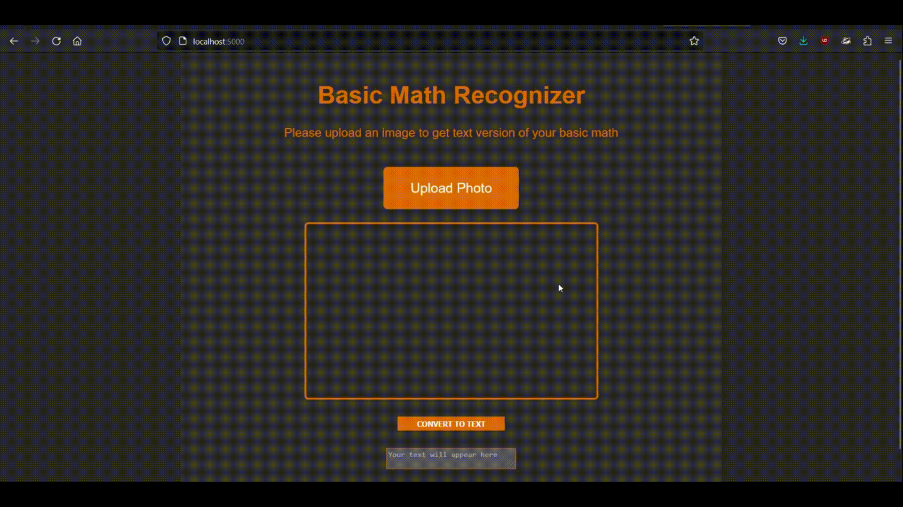
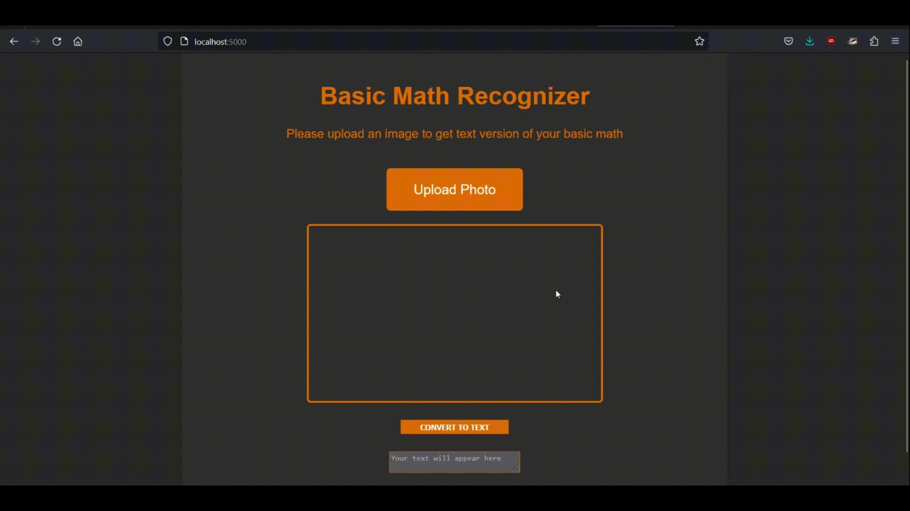

# Basic Math Recognizer

Using the [Handwritten Math Symbols](https://www.kaggle.com/datasets/sagyamthapa/handwritten-math-symbols) dataset from kaggle. Generate a CNN model to recognize the digits (0-9), basic operators (+,-,*,/,=), and 3 commonly used variables (x,y,z).

## Setup:
Create new environment for the application using Anaconda at the root project folder and install the required packages for python

```
$ conda create -p venv python==3.7 -y
$ conda activate venv
$ pip install -r requirements.txt
```

## Run app:
Use the following command to run the Flask server on localhost

```
python ./src/app.py
```

### Website
Open the following URL in the browser of your choice

```
http://localhost:{port}/
```

## Demo




## Train new model

### Get data
To get the data the existing model is trained on use the following command to get src\data\data.csv

```
$ python ./src/data/get_data.py
```

### Modify model
To train the model from scratch using the same model structure, use the following command to train the model on src\data\data.csv. 

```
python ./src/model/train.py
```

To modify the model structure, can edit the file src\model\train.py

The trained model will be saved at src\model\model.h5

## Future work
The model is trained on approximately 400 images for each character, more data can be collected to better train the model. The data for the characters like parentheses or square brackets can be collected to allow more complex equations.

The app can be further expanded to be used as a solver for basic math that is recognized. This can include a syntax checker for the recognized characters, and then solve them using a calculator if they are just digits. Allowing the user to edit the recognized text to use the solver in case of faulty result.

The flask app can be hosted on any cloud platform or can be containerized. Can deploy the app as backend and use a separate Angular or React frontend for better user experience.